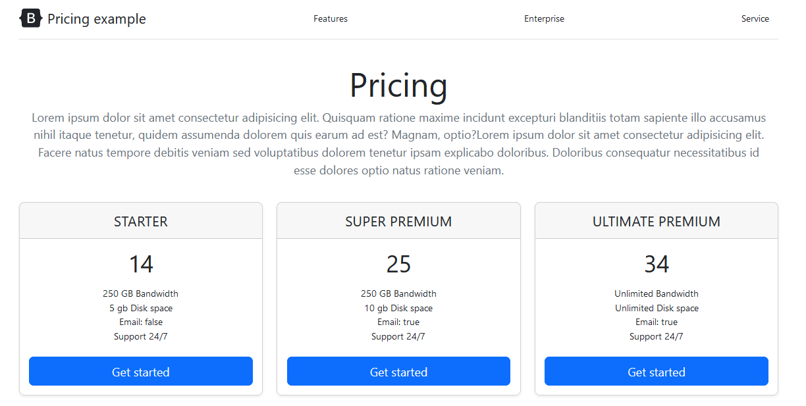

# Lista de precios

This project was created with:

1. bootstrap 5
2. angular
3. flexbox

use of ngFor, ngIf and ngModel

This project was generated with [Angular CLI](https://github.com/angular/angular-cli) version 14.2.3.

## Development server

Run `ng serve` for a dev server. Navigate to `http://localhost:4200/`. The application will automatically reload if you change any of the source files.
